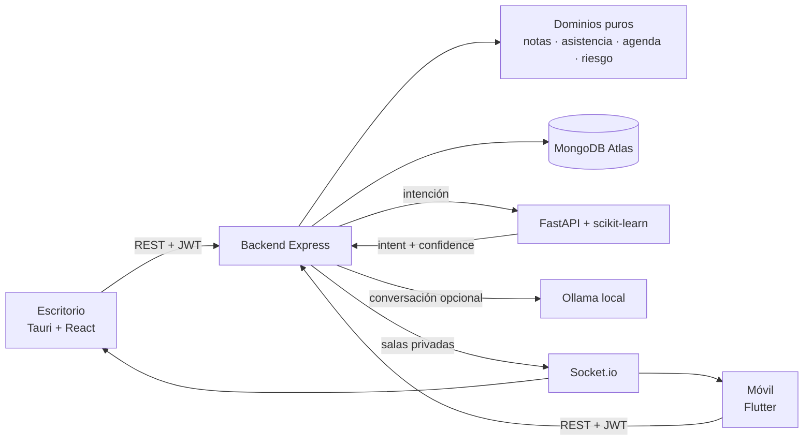

<div align="center">

# UTS Nexus Académico

**Plataforma académica unificada · Unidades Tecnológicas de Santander (UTS)**

[](https://nodejs.org/)
[](https://www.typescriptlang.org/)
[](https://tauri.app/)
[](https://react.dev/)
[](https://flutter.dev/)
[](https://www.mongodb.com/atlas)
[](https://socket.io/)
[](LICENSE)

*Un backend. Una base de datos. Tres interfaces. Todo sincronizado en tiempo real.*

</div>

---

## Índice

- [Licencia](#licencia)
- [Visión general](#visión-general)
- [Arquitectura](#arquitectura)
- [Stack tecnológico](#stack-tecnológico)
- [Modelo académico](#modelo-académico)
- [Motor de calificaciones](#motor-de-calificaciones)
- [Estructura del repositorio](#estructura-del-repositorio)
- [Instalación](#instalación)
- [Variables de entorno](#variables-de-entorno)
- [Roles y permisos](#roles-y-permisos)
- [Credenciales de demo](#credenciales-de-demo)
- [API REST — referencia rápida](#api-rest--referencia-rápida)
- [WebSocket en tiempo real](#websocket-en-tiempo-real)
- [Reportes y exportaciones](#reportes-y-exportaciones)
- [Riesgo académico](#riesgo-académico)
- [Rubri — asistente interno](#rubri--asistente-interno)
- [Seguridad](#seguridad)
- [Testing](#testing)
- [Solución de problemas](#solución-de-problemas)
- [Contribución](#contribución)
- [Comandos útiles](#comandos-útiles)
- [Documentación](#documentación)

---

## Visión general

**UTS Nexus Académico** integra en una sola plataforma la gestión de notas, asistencia, riesgo académico y reportes de las Unidades Tecnológicas de Santander. Docencia, coordinación, secretaría, administración y estudiantes trabajan desde tres aplicaciones independientes que comparten un backend central y una base de datos en la nube — cada rol con su propio alcance: el docente ve lo suyo, coordinación ve sus carreras y secretaría ve lo mismo sin poder modificarlo ([Roles y permisos](#roles-y-permisos)).

```
┌─────────────────────────────────────────────────────────────────┐
│                      UTS Nexus Académico                        │
│                                                                 │
│   📱 App Móvil (Flutter)     🖥️  App Escritorio (Tauri+React)   │
│   Docentes + Estudiantes     Todos los roles                    │
│           │                              │                      │
│           └──────────────┬───────────────┘                      │
│                          ▼                                      │
│            🔧 Backend Central (Node.js / TypeScript)            │
│               Motor de notas · Asistencia · Riesgo              │
│               JWT Auth · WebSocket · REST API                   │
│                          │                                      │
│                          ▼                                      │
│              🍃 MongoDB Atlas (nube central)                     │
└─────────────────────────────────────────────────────────────────┘
```

**Regla de oro:** ningún cliente recalcula notas, asistencia ni riesgo. Todo lo calcula el backend. Los clientes solo muestran los datos. Cero lógica duplicada.

**Rubri** es la mascota y asistente oficial. Reconoce intenciones mediante un
modelo NLP interno, respeta el alcance del usuario y usa cuatro estados visuales
oficiales: neutral, feliz, triste y sin conexión.

---

## Arquitectura

El backend sigue **Clean Architecture / Domain-Driven Design**:



```
backend/src/
├── domains/                  # Lógica de negocio pura (sin I/O)
│   ├── grading/              # Motor canónico de calificaciones
│   ├── attendance/           # Asistencia ponderada por minutos
│   └── risk/                 # Evaluación de riesgo académico
│
├── modules/                  # Capa HTTP (Express)
│   ├── auth/                 # Login · JWT · Refresh tokens · contraseña propia
│   ├── grades/               # CRUD de notas + consolidado
│   ├── attendance/           # Registro y resumen de asistencia
│   ├── enrollment/           # Matrículas (bulk import CSV)
│   ├── analytics/            # Dashboard + riesgos
│   ├── coordination/         # Panorama por carrera: materias, docentes, grupos
│   ├── users/                # Personal: roles y programas a cargo (ADMIN)
│   ├── notifications/        # Alertas + escáner de riesgo
│   └── reports/              # PDF y Excel (notas, asistencia, consolidado)
│
└── shared/                   # Infraestructura transversal
    ├── academic.service.ts   # Agregación única (dashboard + riesgo + reportes)
    ├── professor-scope.ts    # Aislamiento por docente (matrículas + fallback)
    ├── program-scope.ts      # Alcance por carrera (coordinación y secretaría)
    ├── socket.ts             # Socket.io con auth JWT + salas por usuario
    └── scheduler.ts          # Escaneo periódico de riesgo
```

### Principios aplicados

| Principio | Implementación |
|-----------|---------------|
| **Single Source of Truth** | `computeAcademicRecords()` — una sola pipeline usada por dashboard, riesgos, notificaciones y reportes |
| **Professor Scoping** | Toda query filtra por `EnrollmentModel.professorId`; un docente nunca ve datos de otro |
| **Alcance por carrera** | Coordinación y secretaría se acotan por programa académico, no por matrícula; el ámbito del rol se aplica **después** de lo que pide la URL |
| **Partial vs. Final Grade** | El dashboard usa `calcularPromedioParcial()` (solo cortes calificados) para evitar falsos positivos a mitad de semestre |
| **Immutable Domain Functions** | `domains/` son funciones puras sin efectos secundarios, 100% testeables |
| **Secure WebSocket** | Handshake exige JWT; eventos emitidos solo a salas `user:<id>`, nunca broadcast global |

---

## Stack tecnológico

### Backend
| Tecnología | Uso |
|-----------|-----|
| Node.js 20+ / TypeScript (ESM) | Runtime y tipado estático |
| Express 4 | Router HTTP |
| Mongoose 8 | ODM para MongoDB |
| Socket.io 4 | WebSocket con auth y salas |
| Zod | Validación de esquemas en runtime |
| PDFKit | Generación de PDF paginados |
| ExcelJS | Exportación a Excel con estilos |
| bcryptjs + JWT | Autenticación segura |
| tsx | Ejecución directa de TypeScript (scripts) |

### App móvil
| Tecnología | Uso |
|-----------|-----|
| Flutter 3.19+ · Dart 3.8+ | App Android (mínimo Android 7.0 / API 24) |
| Riverpod | Estado reactivo y caché de providers |
| GoRouter | Navegación declarativa |
| Dio | Cliente HTTP con renovación automática de token |
| socket_io_client | WebSocket con auth JWT |
| path_provider + share_plus | Guardar y compartir reportes exportados |

**Sin configuración manual del servidor.** La app descubre el backend sola: barre
la subred del dispositivo preguntando por `/health` y recuerda el que funcionó.
La entrada manual queda como último recurso, para redes con aislamiento de
clientes. Ver `flutter_app/lib/core/network/server_discovery.dart`.

**Navegación por materia.** Los estudiantes no son una lista plana: se llega a
ellos desde su materia (`Materias → Cálculo I → sus estudiantes`), que es como
los busca un docente. Dentro de cada materia la lista se ordena por riesgo, no
alfabéticamente.

| Identificador | `co.edu.uts.nexus.academico` |
|---|---|
| Nombre visible | UTS Nexus Académico |
| Firma | Clave de depuración — **falta un keystore propio para publicar** |

### App de escritorio (v2)
| Tecnología | Uso |
|-----------|-----|
| Tauri 2 (Rust) | Shell nativo — usa el WebView del sistema, no empaqueta Chromium |
| React 19 + TypeScript | Interfaz, con tipos compartidos con el backend |
| Vite 6 | Build y recarga en caliente |
| TailwindCSS 4 | Estilos desde los tokens de `DESIGN.md` |
| Radix UI | Primitivas accesibles (foco, teclado, ARIA) |
| TanStack Query | Estado de servidor: caché, reintentos, invalidación |
| TanStack Virtual | Virtualización de listas largas |
| Zustand | Estado de cliente (sesión, tema, toasts) |
| Zod | Validación de las respuestas del backend en runtime |
| ECharts | Gráficos en canvas (carga diferida) |
| Framer Motion | Microanimaciones y transiciones |
| `keyring` (Rust) | Tokens en DPAPI / Keychain / Secret Service |

> **Instalador: 2,1 MB.** El empaquetado anterior con PyInstaller pesaba ~120 MB.

<details>
<summary>Versión anterior (Python + PySide6) — en desuso</summary>

`desktop_python/` **está muerta**: se eliminó su lanzador y no recibe cambios.
La v2 lleva tiempo siendo la aplicación de escritorio. El código queda como
referencia histórica; ver [`docs/ARQUITECTURA_V2.md`](docs/ARQUITECTURA_V2.md)
para la auditoría que motivó el reemplazo.

| Tecnología | Uso |
|-----------|-----|
| Python 3.10+ | Runtime |
| PySide6 | UI nativa multiplataforma (Qt6) |
| python-socketio | WebSocket para sincronización en tiempo real |
| requests | Cliente HTTP |

</details>

### Base de datos
| Colección | Propósito |
|----------|-----------|
| `usuarios` | Auth (todos los roles) |
| `estudiantes` | Identidad global por cédula |
| `matriculas` | Vincula estudiante ↔ grupo ↔ materia ↔ semestre |
| `materias` | Materias por docente |
| `grupos` | Grupos de una materia |
| `notas` | Nota atómica por (estudiante, materia, corte, componente) |
| `asistencias` | Registro por fecha y duración real en minutos |
| `notificaciones` | Alertas de riesgo con deduplicación |

---

## Modelo académico

```
Usuario ──► Docente
              │
              ├──► Materia (2026-1 / 2026-2)
              │         │
              │         └──► Grupo
              │                 │
              │                 └──► Matrícula ──► Estudiante (por cédula)
              │                          │
              │                          ├──► Notas (corte × componente)
              │                          └──► Asistencias (fecha × minutos)
              │
              └──► Dashboard · Reportes · Notificaciones de riesgo
```

- El **Estudiante** existe globalmente, identificado por su cédula.
- La **Matrícula** lo vincula a un grupo concreto de un semestre concreto.
- Un estudiante puede estar en varios grupos; cada grupo pertenece a un único docente.

---

## Motor de calificaciones

### Por corte (3 componentes)

| Componente | Peso |
|------------|------|
| Trabajos | 30% |
| Parciales | 60% |
| Autoevaluación | 10% |

```
Nota del corte = Trabajos × 0.30 + Parciales × 0.60 + Autoevaluación × 0.10
```

### Nota final (3 cortes)

| Corte | Peso |
|-------|------|
| Corte 1 | 33% |
| Corte 2 | 33% |
| Corte 3 | 34% |

```
Nota final = C1 × 0.33 + C2 × 0.33 + C3 × 0.34    →    aprobado ≥ 3.0  (escala 0–5)
```

### Asistencia (ponderada por minutos reales)

```
% Asistencia = minutos presentes ÷ minutos totales × 100
```

Soporta clases de duración variable (30–300 min). Una clase de 3h pesa el doble que una de 1:30h.

---

## Estructura del repositorio

```
UTS_Nexus_Academico/
│
├── backend/                       # API central (Node.js / TypeScript)
│   ├── src/
│   │   ├── domains/               # Lógica pura, sin I/O: grading, attendance,
│   │   │                          #   risk, agenda, scope (quién ve qué)
│   │   ├── modules/               # Una capacidad por carpeta:
│   │   │                          #   X.routes.ts  → HTTP (no toca Modelos)
│   │   │                          #   X.service.ts → datos y orquestación
│   │   ├── models/                # Esquemas Mongoose
│   │   ├── shared/                # Servicios transversales
│   │   └── scripts/               # seed · smoke · migrate-enrollments
│   ├── .env.example               # Variables de entorno (plantilla)
│   └── package.json
│
├── desktop/                       # App de escritorio v2 (Tauri 2 + React 19)
│   ├── src/
│   │   ├── app/                   # Router, providers, error boundary
│   │   ├── core/                  # HTTP, auth, config, realtime, plataforma
│   │   ├── domain/                # Esquemas zod + puertos (sin React)
│   │   ├── infrastructure/        # Adaptadores HTTP de los puertos
│   │   ├── features/              # 11 pantallas, una por capacidad
│   │   ├── shared/                # Design system, layouts, hooks
│   │   ├── state/                 # Sesión, tema, toasts, sincronización
│   │   └── styles/                # Tokens de diseño
│   ├── src-tauri/                 # Shell nativo (Rust)
│   │   ├── src/commands/          # secure_store · backend · files
│   │   └── capabilities/          # Permisos nativos (lista blanca)
│   ├── tests/                     # Pruebas unitarias (Vitest)
│   └── README.md                  # Guía completa del cliente de escritorio
│
├── desktop_python/                # App de escritorio v1 (PySide6) — MUERTA
│   └── …                          #   sin lanzador; solo referencia histórica
│
├── flutter_app/                   # App móvil (Flutter / Android)
│   ├── lib/
│   │   ├── core/                  # Transversal, una carpeta por tema:
│   │   │                          #   network · auth · notifications ·
│   │   │                          #   storage · data · theme · widgets
│   │   └── features/              # Una capacidad por carpeta: su pantalla,
│   │                              #   sus providers y su data/
│   ├── test/
│   ├── README.md                  # Guía del cliente móvil
│   └── pubspec.yaml
│
├── docs/
│   ├── COMO_ABRIR.md              # Cómo abrir cada aplicación, paso a paso
│   ├── FUNCIONAMIENTO.md          # Guía de uso completa
│   ├── AGENDA_Y_NOTIFICACIONES.md # Agenda, recordatorios y push
│   ├── PUBLICAR_VERSION.md        # Publicar una versión y firmar
│   ├── DESPLIEGUE_AWS.md          # Puesta en producción
│   ├── ARQUITECTURA_V2.md         # 📎 Histórico: decisión del escritorio v2
│   └── REFACTOR.md                # 📎 Histórico: plan de migración original
│
├── CLAUDE.md                      # Arquitectura vigente y reglas del proyecto
├── DESIGN.md                      # Sistema de diseño (tokens, paleta, AA)
│
├── abrir_escritorio.bat           # Lanzador de la app de escritorio v2
├── abrir_android.bat              # Lanzador de la app móvil
├── iniciar.ps1                    # Arranque automático — Windows
├── iniciar.sh                     # Arranque automático — Linux / macOS
├── docker-compose.yml             # Despliegue con Docker
└── README.txt                     # Guía de arranque en texto plano
```

---

## Instalación

Hay **un servidor en producción funcionando** —una instancia EC2 con la base en
MongoDB Atlas— y las dos aplicaciones vienen apuntando a él de fábrica. Eso
cambia cuál es la instalación que te toca:

| Quiero… | Qué instalo | Sección |
|---|---|---|
| **Usar** la plataforma como docente, coordinación o secretaría | Solo la app | [A. Usar](#a-usar-la-plataforma-sin-instalar-el-repositorio) |
| **Desarrollar** o revisar el código | Node, y opcionalmente Rust / Flutter / Python | [B. Desarrollo local](#b-desarrollo-local-windows) |
| **Levantar tu propio servidor** | Docker en una máquina Linux | [C. Servidor propio](#c-servidor-propio-ec2--docker) |

> No hace falta clonar el repositorio para usar la plataforma, y no hace falta
> levantar un servidor para desarrollar los clientes: apuntan al de producción
> mientras no se les diga otra cosa.

---

### A. Usar la plataforma (sin instalar el repositorio)

1. Entra a la **página de descargas** ([utsnexus.github.io](https://utsnexus.github.io))
   o al [último Release](https://github.com/JuanDavid-dev-lang/UTS_Nexus_Academico/releases/latest).
2. **Windows**: descarga el `…-setup.exe` y ejecútalo.
   **Android**: descarga el `.apk`; el teléfono pedirá permiso para instalar
   desde el navegador, y esa autorización la exige el sistema, no la app.
3. Abre e inicia sesión. **No hay que escribir ninguna dirección de servidor.**

A partir de ahí las dos apps **se actualizan solas** desde GitHub Releases:
`Configuración → Actualizaciones` en el escritorio y `Ajustes → Actualizaciones`
en el móvil. El escritorio verifica la firma antes de instalar; el móvil entrega
el APK al instalador de Android.

> El archivo que baja la página de descargas lleva en el nombre una versión
> anterior a la que trae dentro: el enlace de Dropbox apunta a un archivo fijo
> que el workflow sobrescribe en cada publicación. Es lo esperado — está
> explicado en [`docs/PUBLICAR_VERSION.md`](docs/PUBLICAR_VERSION.md) §1.3.

**¿A qué servidor se conectan?** A `https://3-14-147-55.sslip.io`, escrito en
`desktop/src/core/config/env.ts` y en `flutter_app/lib/core/config.dart`. Se
puede cambiar sin recompilar: en el escritorio, `Configuración → Servidor`; en
el móvil, `Ajustes → Servidor`, que además **barre la red local** preguntando por
`/health` para encontrar un backend propio sin que nadie escriba una IP.

---

### B. Desarrollo local (Windows)

Así está montado el equipo de desarrollo. Solo el backend es obligatorio: cada
pieza que falte degrada a algo utilizable, y aquí se dice a qué.

#### B.1 Requisitos

| Pieza | Versión | Hace falta para | Si no está |
|---|---|---|---|
| **Node.js** | **24** (npm 11) | El backend | Con npm 10 el `install` falla con «Missing: yaml»: el lockfile lo mantiene npm 11 |
| **MongoDB Atlas** | cualquier clúster | Guardar los datos | El backend arranca, no conecta, y todo sale vacío |
| Rust + VS Build Tools | estable | Compilar el `.exe` del escritorio | `npm run dev` abre la interfaz en el navegador, sin funciones nativas |
| Flutter SDK | Dart ≥ 3.8 | La app móvil | — |
| Python | 3.12 | `ml_service/`: riesgo con modelo y lectura de PDF y fotos | El backend usa el motor de reglas y lo declara en el campo `source` |
| Ollama | `llama3.1:8b` | El asistente conversacional | El asistente responde con el respaldo del servicio de ML |
| `mongod` local | 6+ | `npm run test:e2e` | Las demás pruebas no tocan la base |

La base **es Atlas, no un Mongo local**: no hay contenedor de Mongo en
`docker-compose.yml` a propósito, porque Atlas ya hace copias y replicación
mejor de lo que las haría una instancia suelta.

#### B.2 Backend

```powershell
git clone https://github.com/JuanDavid-dev-lang/UTS_Nexus_Academico.git
cd UTS_Nexus_Academico
copy backend\.env.example backend\.env
```

Edita `backend/.env` y define como mínimo:

```ini
MONGODB_URI=mongodb+srv://<usuario>:<clave>@<cluster>.mongodb.net/uts_nexus
JWT_ACCESS_SECRET=<cadena larga y aleatoria>
JWT_REFRESH_SECRET=<otra distinta>
CLIENT_ORIGIN=*
# Contraseña fija de las cuentas de demostración. Sin ella el seed genera una
# al azar y la imprime UNA vez: cómodo en un servidor, incómodo aquí.
SEED_PASSWORD=<la que quieras>
```

Comprueba que no haya erratas —**un nombre mal escrito no da error: cae al valor
por defecto**— y arranca:

```powershell
cd backend; npm run check:env; cd ..
powershell -ExecutionPolicy Bypass -File .\iniciar.ps1
```

`iniciar.ps1` verifica Node, copia el `.env` si falta, instala dependencias,
compila TypeScript, siembra los datos de demo, levanta el servidor en una
ventana minimizada y corre el smoke test. Dos banderas para el día a día:

| Bandera | Para qué |
|---|---|
| `-SinSeed` | Arrancar sin volver a sembrar: conserva lo que ya hay en la base |
| `-SoloSmoke` | Probar contra un servidor que ya está arriba |

En Linux, macOS o Git Bash: `chmod +x iniciar.sh && ./iniciar.sh`.

| Qué | Dónde |
|---|---|
| API | `http://localhost:4000/api/v1` |
| Swagger interactivo | `http://localhost:4000/docs` |
| Sonda de salud | `http://localhost:4000/health` |

El backend escucha en `0.0.0.0`, no en `127.0.0.1`: es lo que permite que un
teléfono de la misma red lo alcance.

Las cuentas que deja sembradas —una por rol— están en
[Credenciales de demo](#credenciales-de-demo).

#### B.3 Escritorio

```powershell
cd desktop
npm install
npm run dev            # interfaz en http://localhost:5183, sin Rust
```

`npm run dev` apunta al servidor de producción mientras no se le diga otra cosa.
Para trabajar contra el backend local, crea `desktop/.env.local`:

```ini
VITE_SERVER_URL=http://127.0.0.1:4000
```

Con Rust instalado hay dos modos más:

```powershell
npm run desktop:dev      # ventana nativa con recarga en caliente
npm run desktop:build    # .exe + instaladores NSIS y MSI
```

Requisitos de compilación, solo la primera vez:

```powershell
winget install Rustlang.Rustup
winget install --id Microsoft.VisualStudio.2022.BuildTools -e --override `
  "--wait --passive --norestart --add Microsoft.VisualStudio.Workload.VCTools --add Microsoft.VisualStudio.Component.VC.Tools.x86.x64 --add Microsoft.VisualStudio.Component.Windows11SDK.22621 --includeRecommended"
```

Lo compilado queda en `desktop/src-tauri/target/release/`:

| Artefacto | Para qué |
|-----------|----------|
| `bundle/nsis/…_x64-setup.exe` | Instalación normal (recomendado) |
| `bundle/msi/…_x64_en-US.msi` | Despliegue por política de dominio |
| `uts-nexus-desktop.exe` | Ejecutar sin instalar (portable) |

La versión del nombre sale de `desktop/src-tauri/tauri.conf.json`. También está
`abrir_escritorio.bat`: doble clic, abre el ejecutable si existe y lo compila si
no.

> Guía completa del cliente: [`desktop/README.md`](desktop/README.md)

#### B.4 Móvil

```bash
cd flutter_app
flutter pub get
flutter run
```

- **Emulador de Android**: el `localhost` del PC es `10.0.2.2` para el emulador,
  y el descubrimiento lo prueba solo.
- **Teléfono físico en la misma red**: no escribas nada. `Ajustes → Servidor →
  Buscar` barre la subred —254 sondas en paralelo, unos 2 s— y se queda con
  quien responda `/health` como este backend. Si el router aísla los clientes
  inalámbricos, escribe `http://IP_DEL_PC:4000` a mano.
- `abrir_android.bat` hace lo mismo con un menú: abrir en Android Studio,
  ejecutar o generar el APK.

> Guía visual paso a paso: [`docs/COMO_ABRIR.md`](docs/COMO_ABRIR.md)

#### B.5 Servicio de ML (opcional)

```powershell
cd ml_service
python -m venv .venv
.venv\Scripts\python.exe -m pip install -r requirements.txt
.venv\Scripts\python.exe -m uvicorn app.main:app --port 8100
```

Con `ML_ENABLED=1` y `ML_BASE_URL=http://127.0.0.1:8100` en `backend/.env`, el
riesgo pasa a calcularlo el modelo entrenado y se habilita la lectura de
listados en PDF y foto. **Si el servicio está caído no se rompe nada**: el
backend vuelve al motor de reglas y lo dice en el campo `source`.

#### B.6 Asistente conversacional (opcional)

```powershell
ollama pull llama3.1:8b
```

Con Ollama en `http://localhost:11434` y `AI_ENABLED=1`, el asistente usa el
modelo local; sin él responde con el respaldo del servicio de ML. En producción
está **apagado** a propósito: no cabe en la instancia.

<details>
<summary>App de escritorio v1 (Python) — en desuso</summary>

Su lanzador se eliminó: abrirla por accidente y creer que era la versión actual
es más caro que el rato que ahorra tenerla a mano. El código sigue en
`desktop_python/` como referencia histórica y no recibe cambios.

</details>

---

### C. Servidor propio (EC2 + Docker)

El de producción es una instancia EC2 con tres contenedores —Caddy, backend y
servicio de ML— y la base en Atlas. **Ni el backend ni Python publican puertos**:
solo Caddy escucha desde internet, así que el 4000 y el 8100 no existen desde
fuera aunque el grupo de seguridad se configure mal algún día.

Dentro de una instancia Ubuntu o Amazon Linux recién creada:

```bash
git clone https://github.com/JuanDavid-dev-lang/UTS_Nexus_Academico.git
cd UTS_Nexus_Academico/deploy
./instalar.sh
```

El script instala Docker, deriva el dominio de la IP pública de la instancia,
pide la cadena de Atlas —sin eco en pantalla—, genera los secretos JWT con
`openssl` y escribe `deploy/.env` con permisos 600. Es **idempotente**: si el
`.env` ya existe lo conserva, así que volver a ejecutarlo no regenera ningún
secreto.

El certificado lo pide Caddy solo a Let's Encrypt. Con un nombre `sslip.io`
—`52-1-2-3.sslip.io` resuelve a esa misma IP— el desafío HTTP-01 funciona **sin
comprar dominio ni tocar DNS**, que es como está hoy.

Dos cosas que muerden en una instancia nueva:

- **El correo saliente es obligatorio en producción.** `docker-compose.yml`
  exige `SMTP_HOST` y el backend aborta el arranque sin él, pero `instalar.sh`
  no lo pregunta: hay que añadir las variables `SMTP_*` a `deploy/.env` antes de
  levantar. Mejor que compose falle con un mensaje claro a que el contenedor
  entre en bucle de reinicio.
- **8 GB de disco no alcanzan** para construir las imágenes. El script avisa
  antes de empezar, no a mitad de la compilación.

Actualizar el servidor tras publicar una versión:

```bash
cd UTS_Nexus_Academico && git pull && cd deploy
docker compose up -d --build
```

> ⚠️ **El release de GitHub no actualiza el servidor.** Publicar una versión
> compila y sube los clientes; la instancia se queda donde estaba. Si la versión
> tocó `backend/`, las apps ya actualizadas pedirán rutas que el servidor
> todavía no tiene.

Detalle completo: [`docs/DESPLIEGUE_AWS.md`](docs/DESPLIEGUE_AWS.md).

---

## Variables de entorno

Nombres exactos leídos por `backend/src/shared/env.ts`. Un nombre mal escrito no
da error: el backend cae silenciosamente al valor por defecto.

```env
# backend/.env

# Obligatoria. Sin ella el backend arranca pero no conecta a la base.
MONGODB_URI=mongodb+srv://<user>:<pass>@cluster.mongodb.net/uts_nexus

# Secretos JWT. OJO: la variable es JWT_ACCESS_SECRET, no JWT_SECRET.
JWT_ACCESS_SECRET=tu_secreto_super_seguro
JWT_REFRESH_SECRET=otro_secreto_diferente
ACCESS_TOKEN_TTL=15m
REFRESH_TOKEN_TTL=30d

PORT=4000

# Origen permitido por CORS. Para uso local con la app de escritorio, usa *
# (ver la nota de abajo).
CLIENT_ORIGIN=*

# Escaneo automático de riesgo (0 = desactivado)
RISK_SCAN_INTERVAL_MIN=30

# Tareas periódicas añadidas en la v3
# Avisos de vencimiento de actividades. 15 min basta: las antelaciones son de
# 48 h, 24 h y 2 h, y la ventana de disparo se deriva de este mismo valor.
ACTIVITY_DUE_INTERVAL_MIN=15
# Patrones de inasistencia. Apagado por defecto: la pasada recorre la
# asistencia de todo el alcance. Con varias instancias, actívalo en UNA.
ATTENDANCE_PATTERN_INTERVAL_MIN=0
# Días que se conserva un error de cliente ya resuelto. 0 = para siempre.
TELEMETRY_RETENTION_DAYS=90

# Base aislada para la suite E2E. Nunca un mongodb+srv: la suite borra la base
# al terminar y la propia suite se niega a arrancar contra un clúster remoto.
E2E_MONGODB_URI=mongodb://127.0.0.1:27017

# Asistente de IA local (Ollama)
AI_ENABLED=1
AI_BASE_URL=http://localhost:11434
AI_MODEL=llama3.1:8b
```

| Variable | Por defecto si falta | Consecuencia de omitirla |
|----------|---------------------|--------------------------|
| `MONGODB_URI` | `''` | **El backend no conecta a la base de datos** |
| `JWT_ACCESS_SECRET` | `dev-access` | Tokens firmados con un secreto público conocido |
| `JWT_REFRESH_SECRET` | `dev-refresh` | Ídem para los refresh tokens |
| `CLIENT_ORIGIN` | `*` | Ninguna en local; restringir solo en despliegue público |
| `RISK_SCAN_INTERVAL_MIN` | `0` | Sin escaneo automático de riesgo |
| `ACTIVITY_DUE_INTERVAL_MIN` | `15` | Sin avisos de vencimiento de actividades |
| `ATTENDANCE_PATTERN_INTERVAL_MIN` | `0` | Sin detección de patrones de inasistencia |
| `TELEMETRY_RETENTION_DAYS` | `90` | Los errores resueltos no se purgan nunca |
| `E2E_MONGODB_URI` | `mongodb://127.0.0.1:27017` | La suite E2E busca un mongod local |
| `AI_ENABLED` | `1` | — |

`npm run check:env` avisa de cualquier variable que el backend no lea: casi
siempre es una errata en el nombre, y una errata no da error — cae en silencio
al valor por defecto.

> ### CORS y la app de escritorio
>
> `CLIENT_ORIGIN` controla qué origen acepta el backend. La app empaquetada **no
> se sirve desde `localhost`**: en Windows su origen es `http://tauri.localhost`,
> y el servidor de desarrollo usa `http://localhost:5183`.
>
> Si `CLIENT_ORIGIN` apunta a un puerto concreto (por ejemplo `5173`), el login
> desde el escritorio fallará con un error de red que **no** dice «CORS» — dirá
> simplemente que no hay conexión.
>
> Para uso local, deja `CLIENT_ORIGIN=*`.
>
> ### El backend SÍ es visible en tu red local
>
> `server.listen(PORT)` sin host hace que Node escuche en **todas** las
> interfaces (`0.0.0.0` y `[::]`), no solo en `127.0.0.1`. Compruébalo con
> `netstat -ano | findstr :4000`.
>
> Eso es justo lo que permite que la app móvil se conecte desde el teléfono. Pero
> también significa que cualquiera en la misma red Wi-Fi puede alcanzar la API.
>
> No es tan grave como suena —todos los endpoints exigen JWT y `/health` no
> revela nada—, pero conviene saberlo: no lo uses en una red pública sin un
> cortafuegos delante, y `CLIENT_ORIGIN=*` no es aceptable si algún día publicas
> el backend en internet.
>
> CORS, además, solo lo aplican los navegadores: no protege frente a un cliente
> nativo ni frente a `curl`. La autenticación es lo que protege la API; CORS
> únicamente decide qué páginas web pueden llamarla.

---

## Roles y permisos

Cinco roles. Lo que separa a cada uno del de arriba es **qué alcance ve** y
**si puede escribir**, no qué pantallas tiene.

| Rol | Ve | Escribe | Además |
|---|---|---|---|
| **Administración** | Toda la institución | Todo | Auditoría, telemetría, reapertura de periodos, gestión del personal |
| **Coordinación** | Los programas que tenga asignados | Sí, dentro de ellos | Cierra periodos; **no** los reabre ni entra a la auditoría |
| **Secretaría** | Lo mismo que su coordinación | **Nada** | Consulta y exporta |
| **Docente** | Sus materias, sus grupos, sus estudiantes | Notas y asistencia de lo suyo | — |
| **Estudiante** | Su propio expediente | Nada | — |

**El alcance de un docente sale de la matrícula; el de coordinación y
secretaría, de la carrera.** Coordinación ve todos los grupos de sus programas,
los dicte quien los dicte, y ninguno de los demás. Los programas se asignan en
`Configuración → Cuentas del personal` o en la pantalla **Personal**, y solo
puede hacerlo administración: quien asigna programas decide alcances, así que no
lo mueve quien está debajo.

> **Una cuenta de coordinación o secretaría sin programas asignados ve la
> institución completa.** Es lo que veían antes de que el alcance existiera;
> cerrarlas a «nada» al actualizar las habría dejado con pantallas vacías y sin
> ninguna explicación. La pantalla de Personal lo avisa en la propia fila.

Secretaría no se implementa repitiendo el rol en cada ruta, sino en un solo
sitio: cuenta como coordinación **en lectura**, y un guardián global corta
cualquier escritura por método HTTP. Marcar ruta por ruta cuáles escriben deja
fuera la que se añada mañana, y una ruta de escritura sin marcar no falla:
concede. Las únicas excepciones son las que escriben sobre su propia cuenta
—entrar, salir, marcar un aviso como leído y cambiar su contraseña—.

Exportar cuenta como leer, así que todos los exportables son `GET` y secretaría
los descarga.

---

## Credenciales de demo

> Disponibles tras ejecutar `npm run seed`. La contraseña sale de
> `SEED_PASSWORD` (backend/.env); sin esa variable el seed genera una al azar y
> la muestra una sola vez al terminar.
>
> Coordinación y secretaría se siembran con dos programas asignados
> (Ingeniería de Sistemas y Tecnología en Desarrollo de Sistemas Informáticos):
> ven solo los grupos, docentes y estudiantes de esas dos carreras. Secretaría,
> además, no puede modificar nada — consulta y exporta.

| Rol | Email | Contraseña |
|-----|-------|------------|
| Administrador | `admin@uts.edu.co` | `(la que genere el seed)` |
| Coordinación | `coordinador@uts.edu.co` | `(la que genere el seed)` |
| Secretaría | `secretaria@uts.edu.co` | `(la que genere el seed)` |
| Docente | `docente@uts.edu.co` | `(la que genere el seed)` |
| Estudiante | `estudiante@uts.edu.co` | `(la que genere el seed)` |

---

## API REST — referencia rápida

Esto es el listado completo. Swagger vive en `http://localhost:4000/docs` con el
servidor arriba y se genera de los comentarios `@openapi` de las rutas, así que
lo que muestra no puede quedarse atrás — pero **su cobertura es parcial**: están
anotados los módulos de la evolución v3 (periodos, actividades, auditoría,
salud, telemetría e historial) y el resto se irá anotando cuando se toquen. Los
endpoints que aún no aparecen ahí existen y funcionan; están en esta tabla.

Todos los endpoints requieren `Authorization: Bearer <token>` excepto `/auth/login`,
`/registro` y `/descargas`.

### Listados: paginación

Los listados aceptan `?page=` y `?limit=` y responden con metadatos:

```json
{ "ok": true, "items": [ … ], "total": 3120, "page": 1, "limit": 1000, "hasMore": true }
```

`items` va en la raíz y **cada endpoint conserva por defecto el tope que ya
devolvía**, así que un cliente antiguo que no pagine sigue recibiendo lo mismo
que antes. Sin `total` y `hasMore`, un listado truncado era indistinguible de
uno completo.

### Autenticación
| Método | Ruta | Descripción |
|--------|------|-------------|
| `POST` | `/auth/login` | Login → devuelve `accessToken` + `refreshToken` |
| `POST` | `/auth/refresh` | Renueva el par **rotando** el refresh token: el anterior queda quemado. Guarda siempre el que devuelve |
| `POST` | `/auth/logout` | Revoca la sesión |
| `POST` | `/auth/register` | Alta de cuenta — **solo ADMIN** |
| `POST` | `/auth/recovery/request` | Envía el código de recuperación **por correo** |
| `POST` | `/auth/recovery/reset` | Cambia la contraseña con el código |
| `POST` | `/auth/password` | Cambia la contraseña propia. Cualquier rol; exige la actual y **cierra las demás sesiones**, devolviendo un par nuevo |
| `GET` | `/auth/me` | Usuario de la sesión |
| `POST` | `/registro` | Autorregistro de docente → queda `PENDIENTE` de revisión |

### Notas
| Método | Ruta | Descripción |
|--------|------|-------------|
| `GET` | `/grades` | Notas del docente (o propias si STUDENT) |
| `POST` | `/grades` | Crear nota `{corte, componentType, label, score}` |
| `PATCH` | `/grades/:id` | Actualizar nota |
| `DELETE` | `/grades/:id` | Eliminar nota |
| `GET` | `/grades/consolidado` | Nota final calculada por el backend (requiere `period`) |

### Asistencia
| Método | Ruta | Descripción |
|--------|------|-------------|
| `GET` | `/attendance` | Registros del docente (o propios si STUDENT) |
| `POST` | `/attendance` | Registrar clase `{date, duration, present, studentId, …}` |
| `GET` | `/attendance/summary/:studentId` | Resumen con % ponderado por minutos |

### Matrículas
| Método | Ruta | Descripción |
|--------|------|-------------|
| `GET` | `/enrollments` | Estudiantes matriculados del docente |
| `POST` | `/enrollments` | Matricular un estudiante en un grupo |
| `POST` | `/enrollments/bulk` | Importar lista CSV (cédula, nombres) y matricular |
| `DELETE` | `/enrollments/:id` | Baja suave (estado WITHDRAWN) |

### Analítica
| Método | Ruta | Descripción |
|--------|------|-------------|
| `GET` | `/analytics/dashboard` | Métricas globales calculadas en tiempo real |
| `GET` | `/analytics/risks` | Top-50 estudiantes en riesgo con motivos |

### Notificaciones
| Método | Ruta | Descripción |
|--------|------|-------------|
| `GET` | `/notifications` | Notificaciones del usuario autenticado |
| `POST` | `/notifications/risks/scan` | Disparar escaneo de riesgo manual |
| `PATCH` | `/notifications/:id/read` | Marcar como leída |

### Reportes
| Método | Ruta | Descripción |
|--------|------|-------------|
| `GET` | `/reports/summary` | Resumen agregado para el panel de reportes |
| `GET` | `/reports/pdf/consolidado` | PDF con nota final, estado y % asistencia |
| `GET` | `/reports/pdf/grades` | PDF de notas por corte y componente |
| `GET` | `/reports/pdf/attendance` | PDF de registros de asistencia |
| `GET` | `/reports/pdf/combined` | PDF notas + asistencia |
| `GET` | `/reports/excel/consolidado` | Excel consolidado (Cédula, Estudiante, C1, C2, C3, Nota final, Estado, Asistencia, Semestre) |
| `GET` | `/reports/excel/grades` | Excel de notas |
| `GET` | `/reports/excel/attendance` | Excel de asistencia |
| `GET` | `/reports/excel/combined` | Excel notas + asistencia |

### Asistente de IA
| Método | Ruta | Descripción |
|--------|------|-------------|
| `GET` | `/ai/status` | Estado de Ollama: activo, modelo cargado, URL |
| `POST` | `/ai/chat` | Rubri: intención interna, contexto académico acotado y respuesta local |
| `POST` | `/ai/predict` | Nota necesaria para aprobar + escenarios por estudiante |

### Agenda y horario
| Método | Ruta | Descripción |
|--------|------|-------------|
| `GET` | `/agenda` | Clases, evaluaciones y eventos con horas absolutas + `campusOffsetMinutes` |
| `GET` | `/schedules` · `POST` | Franjas semanales — **único sitio donde se escribe una clase** |

### Importación en dos pasos
| Método | Ruta | Descripción |
|--------|------|-------------|
| `POST` | `/enrollments/import/scan` | **Propone** un listado XLSX, PDF o foto, con confianza por fila |
| `POST` | `/grades/import/scan` | **Propone** notas leídas de Excel, PDF o foto |
| `POST` | `/attendance/scan` | **Propone** una planilla de asistencia fotografiada |
| `POST` | `/grades/bulk` · `/attendance/scan/confirm` | **Escriben** lo que el docente ya revisó |

Escanear nunca escribe. Una cédula mal reconocida no da error: crea un
estudiante que no existe y lo matricula, y eso se descubre semanas después.
CSV/TSV se interpreta en el escritorio y pasa por la misma previsualización.
El formato binario `.xls` legado no se procesa: debe guardarse como `.xlsx` o
`.csv`; intentar tratarlo como OOXML sería aceptar resultados corruptos.

### Actividades académicas
| Método | Ruta | Descripción |
|--------|------|-------------|
| `GET` | `/activities` | Listado paginado y filtrable (materia, grupo, periodo, estado, fechas) |
| `GET` | `/activities/:id` | Detalle. Comprueba el alcance por documento, no solo al listar |
| `POST` | `/activities` | Crear. El `teacherId` de un docente se fuerza al de su sesión |
| `PATCH` | `/activities/:id` | Editar título, descripción, fecha, peso o adjunto |
| `POST` | `/activities/:id/cierre` | Cerrar. Lo puede hacer el docente dueño |
| `POST` | `/activities/:id/reapertura` | Reabrir. **Solo ADMIN/COORDINATOR** |
| `DELETE` | `/activities/:id` | Eliminación lógica |
| `POST` | `/activities/avisos/scan` | Pasada manual del escáner de vencimientos |

**`LATE` no se persiste.** El estado guardado es `OPEN` o `CLOSED` —una decisión
de una persona— y el `estado` que devuelve la API se deriva comparando `dueAt`
con el reloj del servidor. Guardarlo obligaría a un proceso que recorriera todas
las actividades cada minuto, y cualquier fallo suyo dejaría vencidas
presentándose como abiertas sin que nadie lo notara.

### Periodos académicos y cierre oficial
| Método | Ruta | Descripción |
|--------|------|-------------|
| `GET` | `/periods` | Todos: los registrados y los que solo existen por sus datos |
| `GET` | `/periods/:period` | Estado, progreso del cierre y resumen de la fotografía |
| `POST` | `/periods/:period/cierre` | Inicia o **retoma** el cierre (ADMIN/COORDINATOR) |
| `POST` | `/periods/:period/cierre/abortar` | Devuelve a `OPEN` un cierre atascado (ADMIN) |
| `POST` | `/periods/:period/reapertura` | Reabre con motivo obligatorio (**solo ADMIN**) |
| `GET` | `/periods/:period/fotografia` | Consolidado congelado, paginado |
| `GET` | `/periods/:period/fotografia/resumen` | Contadores de la fotografía |

Con el periodo en `CLOSING` o `CLOSED`, **notas, asistencia y matrículas
responden 409** con un mensaje que explica el estado. Horarios, actividades,
avisos y eventos del calendario siguen editables: no forman parte del acta, y
bloquearlos impediría corregir datos sin proteger nada.

### Casos de inasistencia
| Método | Ruta | Descripción |
|--------|------|-------------|
| `GET` | `/attendance/casos` | Casos abiertos por patrón, acotados al docente |
| `POST` | `/attendance/casos/:id/intervencion` | Registrar seguimiento |
| `POST` | `/attendance/patrones/scan` | Pasada manual del escáner (ADMIN/COORDINATOR) |

### Historial del estudiante
| Método | Ruta | Descripción |
|--------|------|-------------|
| `GET` | `/students/:id/historial` | Línea de tiempo unida y ordenada por el backend |

Une matrículas, notas, ausencias y retrasos, alertas de riesgo, intervenciones,
patrones de inasistencia, actividades y cierres de periodo. **El cliente no
cruza colecciones**: si lo hiciera, el escritorio y el móvil contarían dos
historias distintas del mismo estudiante.

### Coordinación y personal
| Método | Ruta | Descripción |
|--------|------|-------------|
| `GET` | `/coordinacion/programas` | Carreras que esta cuenta puede mirar |
| `GET` | `/coordinacion/resumen` | Cifras por programa: materias, grupos, docentes, promedio, riesgo |
| `GET` | `/coordinacion/materias` | Materias del alcance, **cada una con su docente** |
| `GET` | `/coordinacion/docentes` | Docentes del alcance, con las materias que dictan en él |
| `GET` | `/coordinacion/grupos` | Grupos abiertos en el alcance |
| `GET` | `/coordinacion/export.xlsx` | Un libro con las tres hojas |
| `GET` | `/usuarios` · `/usuarios/roles` | Personal y catálogo de roles (**solo ADMIN**) |
| `POST` | `/usuarios` | Alta de una cuenta con su rol y sus carreras (**solo ADMIN**) |
| `PATCH` | `/usuarios/:id` | Cambiar rol, nombre o carreras (**solo ADMIN**) |
| `DELETE` | `/usuarios/:id` | Baja lógica: la cuenta pierde el acceso, su historial se conserva |

Todo `/coordinacion` es lectura, así que secretaría entra a lo mismo. El alta va
por `POST /usuarios` y no por `/auth/register`: esa ruta firma los tokens de la
cuenta recién creada, y crear personal desde ahí dejaba credenciales de otra
persona en la sesión de quien la crea.

### Administración
| Método | Ruta | Descripción |
|--------|------|-------------|
| `GET` | `/audit` · `/audit/:id` · `/audit/catalogo` | Registro de auditoría (**solo ADMIN**) |
| `GET` | `/system/health` | Estado profundo: integraciones y tareas (ADMIN/COORDINATOR) |
| `POST` | `/telemetry/errores` | Alta de un error de cliente (cualquier sesión) |
| `GET` | `/telemetry/errores` | Listado de defectos (ADMIN/COORDINATOR) |
| `PATCH` | `/telemetry/errores/:id` | Marcar resuelto o ignorado (ADMIN) |
| `POST` | `/telemetry/errores/purga` | Purga según `TELEMETRY_RETENTION_DAYS` (ADMIN) |

`/health` (sin `/api/v1`) sigue siendo la sonda pública y mínima. El estado
profundo va autenticado: contar qué integraciones hay configuradas sin sesión
sería regalar el mapa de la instalación.

### Otros
| Método | Ruta | Descripción |
|--------|------|-------------|
| `GET` | `/students` · `/subjects` · `/groups` | Catálogo académico del docente |
| `GET` | `/students/search` | Directorio global — identidad mínima, sin notas ni riesgo |
| `GET` | `/avisos` | Avisos institucionales por sede, facultad y programa |
| `POST` | `/feedback` | Buzón de sugerencias y reportes de error |
| `GET` | `/trabajos-grado/formatos` | Formatos oficiales — solo directores de trabajo de grado |
| `GET` | `/professors` · `PATCH /professors/:id` | Gestión de docentes (ADMIN) |
| `POST` | `/uploads/image` | Subida de imagen — solo JPG, PNG, WebP o GIF verificados |
| `GET` | `/health` | Sonda: estado del servidor **y** de la base de datos |

---

## WebSocket en tiempo real

El servidor emite eventos a **salas privadas por usuario** (`user:<id>`), nunca en broadcast global.

**Conexión (requiere JWT en el handshake):**
```javascript
// Escritorio v2 / Flutter / JS
const socket = io("http://localhost:4000", {
  transports: ["websocket"],
  auth: { token: accessToken },
});
```

Al conectar, el servidor une al cliente a dos salas: `user:<id>` y `role:<ROL>`.
Los roles `ADMIN` y `COORDINATOR` además reciben los eventos dirigidos a otros
usuarios.

**Eventos emitidos:**

| Evento | Payload | Cuándo |
|--------|---------|--------|
| `sync:ready` | `{ ok: true }` | Al completar el handshake |
| `sync:update` | `{ entity, action, id }` | Ante cualquier cambio de datos |
| `sync:pong` | `{ ts }` | Respuesta a `sync:ping` |

`sync:update` es un **evento único** con el detalle en el payload, no una familia
de eventos por entidad:

| Campo | Valores |
|-------|---------|
| `entity` | `student` · `subject` · `group` · `grade` · `attendance` · `enrollment` · `notification` · `schedule` · `activity` · `professor` |
| `action` | `create` · `update` · `delete` · `bulk` · `read` · `risk` · `reorder` |
| `id` | Identificador del registro afectado |

El cliente de escritorio v2 mapea cada `entity` a las claves de caché que
invalida, así que solo se refresca la pantalla afectada
(`desktop/src/core/realtime/socket.ts`).

---

## Reportes y exportaciones

- **PDF paginados**: encabezado repetido en cada página nueva, texto legible (color de relleno siempre reseteado), márgenes correctos.
- **Excel**: encabezado con fila fija (`freeze`), filtros automáticos, anchos de columna ajustados.
- Todos los reportes soportan filtros por `period`, `subjectId`, `groupId`, `studentId`.

---

## Riesgo académico

El backend evalúa riesgo combinando **rendimiento parcial + asistencia**:

| Nivel | Condición |
|-------|-----------|
| 🔴 **ALTO** | Puntaje ≥ 60 · ó · asistencia < 60% · ó · promedio < 2.0 |
| 🟡 **MEDIO** | Puntaje ≥ 30 · ó · asistencia < 70% · ó · promedio < 3.0 |
| 🟢 **BAJO** | Ninguna de las anteriores |

> El riesgo usa `calcularPromedioParcial()` — solo los cortes ya calificados, con pesos renormalizados — para evitar que un buen estudiante aparezca en riesgo a mitad de semestre por cortes aún no dictados.

**Activación automática:** `RISK_SCAN_INTERVAL_MIN=30` en `.env`
**Activación manual:** botón «Escanear riesgo» en la app de escritorio (pantallas
*Riesgo* y *Notificaciones*) o `POST /notifications/risks/scan`

En la app de escritorio v2, cada alerta muestra siempre el **motivo** junto al
nivel —nunca solo un color—, porque de esa insignia depende que un docente
decida intervenir con un estudiante.

Las notificaciones son **idempotentes** (sin duplicados) y se envían al docente y al propio estudiante por WebSocket.

---

## Rubri — asistente interno

Rubri integra tres capas separadas: interfaz emocional, clasificador NLP interno
y servicios autorizados del backend. El clasificador FastAPI/scikit-learn recibe
el mensaje y devuelve `intent`, `confidence`, alternativas y latencia. No toca
la base de datos. El backend aplica JWT, rol, alcance del docente, umbral de
confianza y lista blanca de navegación antes de devolver cualquier acción.

El dataset inicial contiene 179 expresiones españolas para 11 intenciones. La
evaluación estratificada reproducible de `rubri-intents-v3` obtuvo accuracy
0.8000, precisión macro 0.8561, recall macro 0.8000 y F1 macro 0.7946. Ollama
puede redactar respuestas más naturales dentro de la infraestructura, pero no
es obligatorio para clasificar ni para mantener operativa la plataforma.

Los detalles de privacidad, entrenamiento, endpoints, estados visuales y cómo
agregar intenciones están en [`docs/RUBRI.md`](docs/RUBRI.md).

---

## Comandos útiles

```bash
# Desde /backend  (Node 24)
npm run check:env        # Verifica el .env sin imprimir secretos
npm run dev              # Servidor con recarga automática (desarrollo)
npm run build            # Compilar TypeScript
npm start                # Servidor compilado (producción)
npm run seed             # Sembrar / resetear datos de demo
npm run smoke            # Smoke test (servidor debe estar arriba y sembrado)
npm run test:e2e         # Suite E2E completa sobre una base aislada
npm test                 # Pruebas del dominio puro (Vitest, sin base ni servidor)
npm run lint             # ESLint
npm run migrate:enrollments  # Migrar studentIds[] a colección Matrículas
npm run migrate:v3           # Periodos, lateMinutes y periodo de actividades
npm run migrate:v3 -- --aplicar   # …y escribirlo de verdad (por defecto simula)

# Desde /desktop
npm run dev              # Interfaz en el navegador (no requiere Rust)
npm run desktop:dev      # Ventana nativa con recarga en caliente
npm run desktop:build    # Ejecutable + instaladores NSIS y MSI
npm run typecheck        # Verificación de tipos
npm run lint             # ESLint
npm test                 # Pruebas unitarias (Vitest)

# Desde /flutter_app
flutter pub get          # Instalar dependencias
flutter run              # Ejecutar en emulador o dispositivo
flutter test             # Pruebas
flutter analyze          # Análisis estático
flutter build apk        # APK de instalación

# Desde /ml_service
python -m venv .venv && .venv/bin/pip install -r requirements.txt
.venv/bin/python -m uvicorn app.main:app --port 8100
.venv/bin/python -m pytest tests/

# Docker
docker compose up --build   # Levantar backend en contenedor
```

---

## Documentación

**Empezar aquí**

| Documento | Contenido |
|-----------|-----------|
| [`docs/COMO_ABRIR.md`](docs/COMO_ABRIR.md) | Cómo abrir cada aplicación, paso a paso |
| [`docs/FUNCIONAMIENTO.md`](docs/FUNCIONAMIENTO.md) | Guía de uso: roles, flujos, cálculos, preguntas frecuentes |
| [`README.txt`](README.txt) | Arranque en texto plano, para abrir sin visor de Markdown |
| `http://localhost:4000/docs` | **Swagger interactivo** — la referencia de la API siempre al día |

**Para trabajar en el código**

| Documento | Contenido |
|-----------|-----------|
| [`CLAUDE.md`](CLAUDE.md) | **Arquitectura vigente y reglas del proyecto**: el molde de un módulo, quién ve qué, rendimiento de los clientes, trampas conocidas |
| [`DESIGN.md`](DESIGN.md) | Sistema de diseño: paleta, tipografía, componentes y accesibilidad |
| [`desktop/README.md`](desktop/README.md) | Cliente de escritorio: requisitos, comandos, estructura |
| [`flutter_app/README.md`](flutter_app/README.md) | Cliente móvil: estructura y reglas de rendimiento |
| [`ml_service/README.md`](ml_service/README.md) | Ciclo de entrenamiento, endpoints y promoción de modelos |

**Operación**

| Documento | Contenido |
|-----------|-----------|
| [`docs/AGENDA_Y_NOTIFICACIONES.md`](docs/AGENDA_Y_NOTIFICACIONES.md) | Agenda, recordatorios locales, push de Android y qué configurar |
| [`docs/CIERRE_Y_ADMINISTRACION.md`](docs/CIERRE_Y_ADMINISTRACION.md) | Cierre de periodos, auditoría, centro de salud, patrones de inasistencia, telemetría, historial, migración v3 y suite E2E |
| [`docs/RUBRI.md`](docs/RUBRI.md) | Arquitectura segura, clasificador NLP, métricas, privacidad y sprites de Rubri |
| [`docs/PUBLICAR_VERSION.md`](docs/PUBLICAR_VERSION.md) | Publicar una versión, secretos de CI y claves de firma |
| [`docs/DESPLIEGUE_AWS.md`](docs/DESPLIEGUE_AWS.md) | Puesta en producción con Docker y Caddy |

**Histórico** — explican *por qué* las cosas están como están, no cómo están hoy

| Documento | Contenido |
|-----------|-----------|
| [`docs/ARQUITECTURA_V2.md`](docs/ARQUITECTURA_V2.md) | Auditoría de la v1 en Python y decisión del escritorio actual |
| [`docs/REFACTOR.md`](docs/REFACTOR.md) | Plan de migración a backend único como fuente de verdad |

---

## Seguridad

- Contraseñas con bcrypt y longitud de entrada acotada para evitar abuso de CPU.
- Access token corto y refresh token rotatorio; en Android se guardan en el
  almacén seguro del sistema. Reutilizar un refresh revoca la
  familia de sesiones. Rechazar un registro docente también revoca sus sesiones.
- Autorización en backend por rol y alcance. El frontend oculta acciones por
  experiencia de uso, nunca como control de seguridad.
- Docentes limitados por matrícula, materia y grupo; los endpoints por ID aplican
  el mismo alcance que los listados.
- Zod valida cuerpos, consultas, paginación y tamaños. MongoDB no recibe filtros
  arbitrarios del cliente.
- Archivos en memoria, límite de 12 MB y flujo propuesta → revisión → escritura.
  Fotos y PDF no se conservan después de interpretarlos.
- Errores 5xx sin detalles internos; `/health` no expone causas de conexión.
- Socket.io exige JWT y emite a salas autenticadas o usuarios concretos.
- Rubri no accede a MongoDB, no ejecuta URLs del modelo y no entrena con datos
  académicos reales de forma automática.

En producción usa HTTPS, secretos distintos y largos, un usuario MongoDB con
privilegios mínimos, CORS explícito, copias de seguridad de Atlas y límites de
red para FastAPI/Ollama. Nunca copies `.env`, claves FCM, SMTP ni firma Tauri al
repositorio.

La primera apertura móvil migra la sesión antigua a almacenamiento seguro de
forma idempotente: completa primero la escritura segura y borra la
copia plana solo después. Volver a una versión anterior no pierde datos
académicos, pero exige iniciar sesión nuevamente porque esa versión no conoce el
almacén seguro.

---

## Testing

| Capa | Comando | Cobertura principal |
|---|---|---|
| Backend puro | `cd backend && npm test` | Notas, asistencia, riesgo, agenda, alcance, importación y reportes |
| Backend E2E | servidor arriba + `npm run smoke` | Login y flujo REST contra MongoDB |
| Escritorio | `cd desktop && npm test` | Parsers, permisos, navegación, caché y errores |
| Escritorio tipos | `npm run typecheck` | Contratos TypeScript |
| Móvil | `cd flutter_app && flutter test` | Red, tema, navegación, caché y tiempo del campus |
| Móvil estático | `flutter analyze` | Lints y tipos Dart |
| ML | `cd ml_service && python -m pytest tests/` | Riesgo, Rubri, OCR y lectura de archivos |

Las pruebas de dominio no necesitan red ni base. El smoke sí requiere backend y
MongoDB configurados. Las pruebas OCR descargan/cargan modelos ONNX y pueden
tardar varios minutos la primera vez.

---

## Solución de problemas

| Síntoma | Causa habitual | Solución |
|---|---|---|
| Backend inicia pero no hay datos | `MONGODB_URI` ausente o inaccesible | Ejecuta `npm run check:env` y revisa la allowlist de Atlas |
| Login de escritorio da “error de red” | CORS no incluye Tauri | En local usa `CLIENT_ORIGIN=*`; en producción declara los orígenes exactos |
| Móvil no encuentra servidor | Aislamiento Wi-Fi o firewall | Permite puerto 4000 y escribe `http://IP_DEL_PC:4000` en login |
| Horarios corridos cinco horas | Offset de campus incorrecto | Usa `CAMPUS_UTC_OFFSET_MIN=-300` para Colombia |
| Rubri aparece sin conexión | FastAPI u Ollama detenido | Inicia FastAPI en 8100; Ollama es opcional para el clasificador |
| El modelo de Ollama no está listo | Modelo no descargado | Ejecuta `ollama pull llama3.1:8b` o cambia `AI_MODEL` |
| `.xls` no abre | Formato binario legado | Guarda el archivo como `.xlsx` o `.csv` antes de importar |
| Push no llega con app cerrada | FCM no configurado | Define `FCM_PROJECT_ID`, `FCM_CLIENT_EMAIL` y `FCM_PRIVATE_KEY` |
| Recuperación no envía correo | SMTP apagado | Configura las variables SMTP; en desarrollo sin SMTP revisa `devCode` |
| Coordinación ve toda la institución | Cuenta sin carreras asignadas | Asígnalas en **Personal**: sin ninguna, el alcance es la institución completa a propósito |
| Coordinación no ve una materia suya | La materia no declara programa | Márcaselo en Materias; mientras tanto se deduce de la adscripción del docente, y la pantalla lo señala con `*` |
| «Tu perfil es de consulta» al guardar | La cuenta es de secretaría | Es lo esperado: secretaría ve y exporta, no modifica |
| El `.exe` no ofrece la versión nueva | No se subió el número | Hay que subirlo en los cinco archivos y empujar la etiqueta — [`docs/PUBLICAR_VERSION.md`](docs/PUBLICAR_VERSION.md) §3.1 |
| Las apps actualizadas fallan contra el servidor | El release no actualiza EC2 | Entra a la instancia: `git pull && docker compose up -d --build` |
| `npm install` falla con «Missing: yaml» | Node 22 (npm 10) | El lockfile lo mantiene npm 11: usa Node 24 |

---

## Contribución

1. Crea una rama corta y describe el problema que resuelve.
2. Conserva la lógica académica en `backend/src/domains/`; ningún cliente
   recalcula notas, asistencia, agenda o riesgo.
3. En rutas nuevas: validar, autorizar, delegar y responder. El acceso a modelos
   pertenece al servicio del módulo.
4. Usa tokens de `DESIGN.md`; no introduzcas colores ni tamaños crudos en pantallas.
5. Añade pruebas para cambios de reglas, permisos, parsers y contratos.
6. Ejecuta tests, lint y typecheck de los componentes tocados.
7. Documenta variables o pasos operativos nuevos sin publicar secretos.

Los commits y la documentación del repositorio se escriben en español. No se
aceptan cambios que abran el registro administrativo, debiliten el alcance de
docentes, dupliquen estudiantes globales o hagan opcional la revisión previa de
una importación.

---

## Estado del proyecto

| Componente | Estado |
|-----------|--------|
| Backend (Node.js / TypeScript) | ✅ Operativo · **335 pruebas** |
| App de escritorio (Tauri 2 + React 19) | ✅ Operativa · **124 pruebas** |
| App móvil (Flutter / Android) | ✅ Operativa · **89 pruebas** |
| Servicio de ML (`ml_service/`) | ✅ Operativo · **54 pruebas** — ver [`ml_service/README.md`](ml_service/README.md) |
| App de escritorio v1 (PySide6) | 🪦 Muerta · sin lanzador, solo referencia histórica |
| Pruebas E2E | ✅ `npm run test:e2e` · **114 comprobaciones** sobre una base aislada |

Las pruebas de `npm test` cubren **lógica pura**: cálculo de notas, riesgo,
agenda, alcance por docente y por programa, quién puede escribir, filtros,
paginación y navegación. Ninguna toca la base de datos.

Para lo que sí la toca hay dos niveles: `npm run smoke` recorre el camino
principal contra el servidor que ya tengas arriba, y `npm run test:e2e` levanta
un `mongod` local, crea su propia base, recorre 114 comprobaciones —incluidos el
alcance por carrera, el 403 de secretaría al escribir y el cierre de sesiones al
cambiar una contraseña— y borra la base al terminar. La suite **se niega a
arrancar contra un `mongodb+srv`**: borra lo que toca.

### Predicción de riesgo con aprendizaje

`ml_service/` sustituye los umbrales fijos de `domains/risk` (promedio < 3.0,
asistencia < 70%) por un modelo entrenado. Python + FastAPI + scikit-learn, con
explicación SHAP obligatoria: **ninguna predicción sale sin decir qué la causó**.

Arranca con un modelo derivado de las reglas actuales —porque una institución
nueva no tiene casos cerrados con los que entrenar— y aprende de verdad cuando
el docente valora las alertas y se cierran los semestres. Un modelo nuevo solo
reemplaza al vigente **si le gana en validación**; se compara por recall, porque
dejar de detectar a un estudiante en riesgo es peor que revisar a uno que estaba
bien.

Si el servicio se cae, el backend usa el motor de reglas y lo declara en el
campo `source` (`model` o `rules`). El docente siempre sabe de dónde salió la
alerta.

```ini
# backend/.env
ML_BASE_URL=http://127.0.0.1:8100
ML_ENABLED=1
```

---

## Licencia

**PolyForm Noncommercial 1.0.0** — ver [`LICENSE`](LICENSE).

Los derechos son de las **Unidades Tecnológicas de Santander**; el desarrollo,
del **Grupo CIAI**.

**Qué se permite.** Usar, copiar, modificar y redistribuir el proyecto para
cualquier fin **no comercial**: docencia, estudio, investigación, proyectos
personales y uso por parte de instituciones educativas, organismos públicos y
entidades sin ánimo de lucro. La licencia nombra explícitamente a las
instituciones educativas y públicas como uso permitido, así que las UTS y
cualquier otra institución pueden usarlo y adaptarlo sin pedir permiso.

**Qué no.** Venderlo, cobrar por él, ofrecerlo como servicio de pago o
incorporarlo a un producto comercial. Para cualquiera de esas cosas hace falta
una autorización aparte de las UTS.

**No es código abierto.** Aunque el código esté publicado y se pueda leer,
restringir el uso comercial excluye al proyecto de la definición de la OSI, que
exige no discriminar ningún campo de uso. Es *source-available*, no open source
— la diferencia importa si alguien lo cita en un trabajo o en una convocatoria.

Se eligió PolyForm y no una licencia Creative Commons porque las CC no están
pensadas para software y la propia Creative Commons desaconseja usarlas con
código. PolyForm Noncommercial está redactada para software y su identificador
SPDX es `PolyForm-Noncommercial-1.0.0`.

El software se entrega **sin garantía**. Los cálculos académicos —notas,
asistencia y riesgo— siguen el reglamento de las UTS, pero la responsabilidad
sobre las notas reportadas es de cada docente y de la institución.

---

<div align="center">

**Unidades Tecnológicas de Santander · Bucaramanga, Colombia**

Desarrollado con Clean Architecture · DDD · Single Source of Truth

</div>
