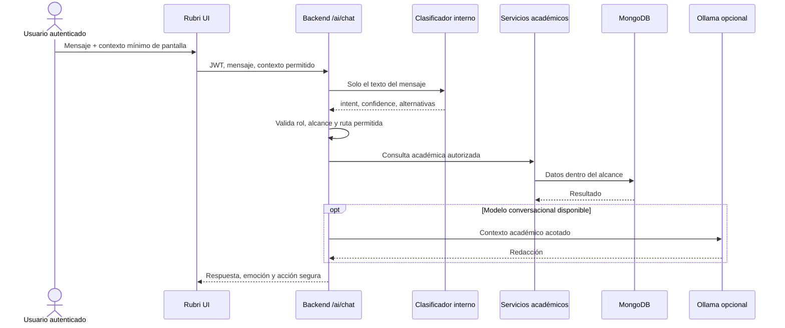

# Rubri: asistente interno de UTS Nexus

Rubri es la mascota oficial y la interfaz del asistente académico. Sus cuatro
sprites —neutral, feliz, triste y sin conexión— proceden de la lámina oficial
entregada con el proyecto. Los clientes resuelven la emoción desde un único
componente; ninguna pantalla mantiene rutas de imágenes propias.

## Arquitectura y límites de confianza



El modelo no accede a MongoDB, no genera URLs, no ejecuta comandos y no escribe.
Las acciones navegables salen de una lista blanca del backend. Los cambios
importantes siguen usando los formularios y confirmaciones normales de UTS
Nexus. Un docente conserva exactamente el mismo alcance que en las rutas REST.

## Clasificador NLP

El clasificador vive en `ml_service/app/rubri_intents.py` y usa TF-IDF de
caracteres (3–5) más regresión logística. Es aprendizaje automático real,
pequeño, interpretable y ejecutable sin Internet. El dataset versionado está en
`ml_service/data/rubri_intents.json`.

- Versión: `rubri-intents-v3`.
- Dataset: 179 frases redactadas para la plataforma.
- Intenciones: 11.
- División de evaluación: 75 % entrenamiento / 25 % prueba, estratificada y con
  semilla fija 42.
- Métricas actuales: accuracy 0.8000, precisión macro 0.8561, recall macro
  0.8000 y F1 macro 0.7946.
- Artefacto: `ml_service/models/rubri-intents.joblib`, generado en el primer
  arranque y excluido del repositorio.

Intenciones vigentes: `CREATE_COURSE`, `GET_COURSES`, `GET_STUDENTS`,
`IMPORT_STUDENTS`, `GET_SCHEDULE`, `UPDATE_SCHEDULE`, `GET_CLASSROOM`, `HELP`,
`NAVIGATE`, `SEARCH_STUDENT` y `COURSE_INFORMATION`.

Para reentrenar y comprobar:

```powershell
cd ml_service
py -3.11 -m venv .venv
.venv\Scripts\python.exe -m pip install -r requirements.txt
.venv\Scripts\python.exe -m pytest tests\test_rubri_intents.py -q
```

Al cambiar el dataset debe incrementarse `VERSION`; el servicio regenerará el
artefacto de forma atómica. `GET /rubri/metrics` expone versión, métricas y
matriz de confusión; `POST /rubri/intent` devuelve intención, confianza, tres
alternativas y latencia.

## Confianza, respuestas y privacidad

Con confianza inferior a 0.42 Rubri pregunta por más contexto y no propone una
acción. El umbral es conservador: una intención equivocada no debe convertirse
en navegación o cambio académico. El backend registra intención, confianza y
latencia, pero no la conversación completa.

El texto enviado al clasificador no contiene datos de estudiantes añadidos por
el servidor. El contexto de pantalla solo admite `page`, `courseId` y `groupId`;
los identificadores se validan contra el alcance del usuario antes de consultar.
Los datos académicos reales nunca alimentan automáticamente el dataset.

Ollama es una capa conversacional local opcional, no el clasificador. Si no está
disponible, Rubri conserva la clasificación y las respuestas deterministas que
puedan resolverse de forma fiable. El estado visual pasa a `offline`; el resto
de UTS Nexus sigue funcionando.

## Sprites y componentes

Escritorio:

- `desktop/src/assets/rubri/*.png`
- `desktop/src/shared/ui/rubri.tsx`

Móvil:

- `flutter_app/assets/rubri/*.png`
- `flutter_app/lib/core/widgets/rubri.dart`

Los componentes respetan reducción de movimiento. La animación es un balanceo
leve; no altera la identidad del personaje. La emoción se selecciona mediante
el valor semántico `neutral | happy | sad | offline` devuelto por el backend.

## Agregar una intención

1. Añadir frases variadas al dataset, sin datos personales.
2. Incorporar el nombre a `RUBRI_INTENTS` del backend.
3. Si necesita navegación, añadir solo una ruta interna conocida a `ACTIONS`.
4. Agregar frases representativas a la prueba.
5. Incrementar la versión, reentrenar y revisar matriz de confusión.
6. No conectar una intención directamente a un modelo ni a una colección.
