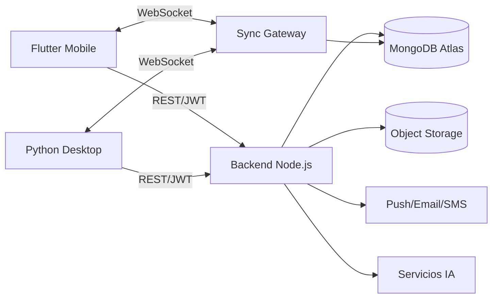

# Arquitectura

## Capas

- `apps/mobile_flutter`
- `apps/desktop_python`
- `services/api`
- `docs`

## Principios

- Clean Architecture
- SOLID
- Repository Pattern
- Auditable
- Soft delete
- Multi-rol

